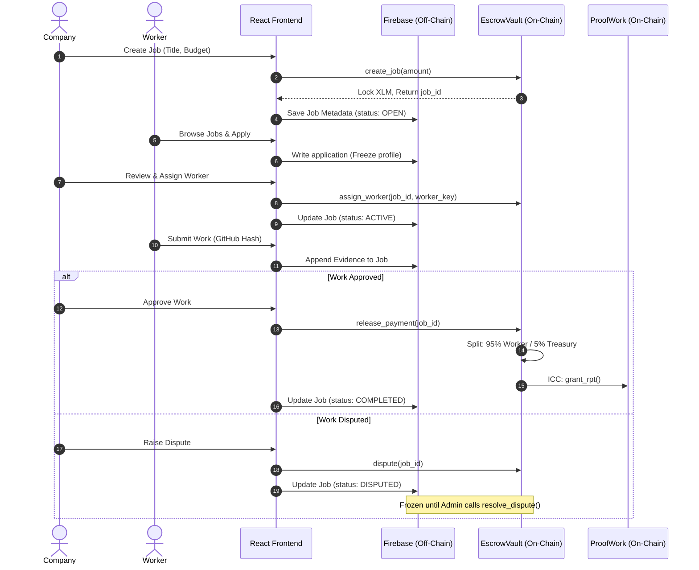
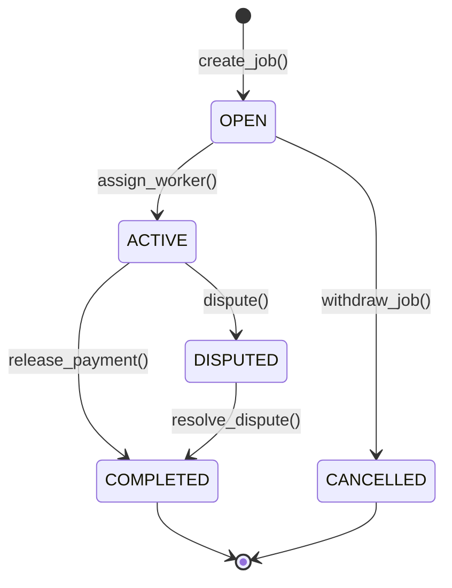

# 🚀 Dashy: The Dystopian Labor Protocol

**An Exhaustive Technical Manual for the Decentralized Job-Matching, Reputation, and Escrow Ecosystem on the Stellar Network.**

Dashy bridges the gap between companies and workers with a premium, dystopian "Vault-Tec" interface. Featuring high-fidelity NFT assets, real-time trust scoring, robust smart contract Escrow logic, and an automated payment gateway natively built on the Stellar Testnet (Soroban).

---

# 🔗 Platform Links

- **Live DApp Terminal:** [Dashy Live Protocol](https://dashy-freelance.vercel.app/)

---

---

## 1. Protocol Philosophy & Vision

Dashy is designed as a **trustless enforcement protocol**. In traditional freelance marketplaces (Upwork, Fiverr), a centralized intermediary holds the funds, arbitrates disputes opaquely, and extracts exorbitant fees (15-20%). 

Dashy eliminates the middleman. By leveraging **Soroban Smart Contracts** on the Stellar network, funds are locked automatically, transfers are mediated strictly by cryptographic code, and non-transferable Reputation Tokens (RPT) are issued automatically upon success. 

The application uses a "Dystopian/Vault-Tec" aesthetic—employing CRT scanlines, deep glassmorphism, and neon phosphor accents—delivering a highly gamified, premium user experience that feels like operating a futuristic terminal.

---

## 2. Ecosystem Roles & Core Workflows

The dApp restricts operations based on three primary, distinct user personas, each interacting with different components of the Smart Contracts and Firestore database.

### The Worker Persona
Workers are the labor engine of the protocol.
* **Browsing (Querying):** Workers access `DashboardWorker.jsx` to fetch jobs where `status == "OPEN"`.
* **Applying (Writing):** Applying creates an `application` sub-document in Firestore under the specific job. It freezes the worker's current profile state (skills, bio) to prevent bait-and-switch tactics.
* **Execution (Submitting Evidence):** Once hired, the worker submits a payload containing a `githubHash`, `docLink`, and `notes`. This is appended to the job document for the company to review.
* **Reputation & Payout:** Upon company approval, the EscrowVault executes `release_payment()`, transferring 95% of the XLM budget to the worker and invoking ProofWork to mint RPT, leveling up their Trust Badge.

### The Company Persona
Companies provide the capital and the pact requirements.
* **Job Posting (Contract Creation):** Companies define requirements and a budget. Calling `create_job()` **immediately locks** the specified XLM in the on-chain EscrowVault. This provides absolute cryptographic proof of liquidity to workers.
* **Applicant Review & Hiring:** Companies review applicant arrays in Firestore. Clicking "Assign" triggers the on-chain `assign_worker()` function, locking the contract to that specific worker's public key.
* **Approval & Settlement:** When reviewing submitted evidence, the company can approve. This triggers the atomic release of funds. If evidence is lacking, they can trigger the `dispute()` protocol.

### The Administrator Persona
The Administrator operates from `DashAdmin.jsx`, utilizing God-Mode privileges.
* **Diagnostics:** Runs live RPC pings against the smart contracts to verify network state, escrow initialization, and inter-contract links.
* **Mediation:** Resolves frozen `DISPUTED` jobs by evaluating evidence and using a sliding percentage scale to divide locked funds.
* **Treasury & Governance:** Has authorization to execute emergency sweeps of accumulated protocol fees, mint Genesis NFTs, and pause contracts.

---

## 3. Identity & Authentication Architecture

Dashy operates entirely without traditional passwords. Identity is derived cryptographically from Stellar wallets.

### Authentication Pipeline
1. **Wallet Injection:** The app utilizes the `@stellar/freighter-api` and custom hooks to interface with Freighter, xBull, Hana, Rabe, and Albedo.
2. **Key Extraction:** The user signs a connection request, returning their `ed25519` Public Key (e.g., `GABC...XYZ`).
3. **Context Hydration:** The `WalletContext.jsx` provider takes this key and queries Firestore (`users` collection). 
4. **State Construction:** If the user is found, global state is populated with their role, avatar, and cached RPT balance. If not found, they are routed to the onboarding funnel.

---

## 4. Job Lifecycle & Architecture Workflow

The entire Pact lifecycle ensures absolute financial security through strict State Machine transitions and synchronized data flows between the Frontend, Firestore, and the EscrowVault.

### 🌐 Architecture Workflow Diagram
This sequence diagram outlines the complete interaction loop for a single Pact.



### ⚙️ On-Chain State Machine


- **OPEN (State 0):** XLM is locked. Awaiting a worker.
- **ACTIVE (State 1):** Worker assigned. Work is in progress.
- **COMPLETED (State 2):** Funds disbursed. RPT issued. Terminal state.
- **DISPUTED (State 3):** Conflict raised. Funds frozen. Awaiting admin.
- **CANCELLED (State 4):** Job aborted before assignment. Funds refunded to Company.

---

## 5. Smart Contract Infrastructure (Soroban)

Compiled to WebAssembly (WASM) and deployed on the Stellar Testnet, these contracts form the immutable backbone of Dashy.

### A. Registry Contract
**Contract ID:** `CDXB4OYLH4RRUFF2WXOJ7EQVMETIYS3QAO4OCQSF5N72HV6C7NFKBGHH`
- **Architecture:** Uses Soroban's persistent storage to map user addresses to registration metadata.
- **Staking Logic:** Requires a cross-contract call to the native Stellar Asset Contract to lock XLM. 1,000 XLM for workers, 10,000 XLM for companies.

### B. EscrowVault Contract
**Contract ID:** `CACN5PFTVFJHGAFZ47MB5FXQPDN7QM4RNP5OVFBQ64B2VULWONFS5VAH`
- **Data Structures:** Stores jobs in a `Map<u64, Job>` where `Job` contains `company`, `worker`, `amount`, `state`, and `dispute_reason`.
- **Payment Split Logic:**
  ```rust
  let total = job.amount;
  let protocol_fee = total * 5 / 100;
  let worker_payout = total - protocol_fee;
  // Transfer to worker
  token.transfer(&env.current_contract_address(), &job.worker.unwrap(), &worker_payout);
  // Transfer to treasury
  token.transfer(&env.current_contract_address(), &treasury, &protocol_fee);
  ```

### C. ProofWork Contract
**Contract ID:** `CDS6J5XMEGDJPQ4XEKJFJOCHB6NFC732K4SXDPSQHUDQKJAR757I6UZE`
- **Security:** Uses `require_auth()` to ensure only whitelisted contracts (like EscrowVault) can mint RPT tokens. This prevents arbitrary inflation.
- **Tier Algorithm:** Computes Trust Tiers natively on-chain. Tier = `log2(RPT)`.

---

## 6. Inter-Contract Communication (ICC) Specifications

Soroban allows smart contracts to invoke each other. Dashy leverages this for atomic reputation issuance.

When `release_payment()` succeeds in EscrowVault, it executes a cross-contract call to ProofWork:
1. EscrowVault retrieves the ProofWork contract ID from its own instance storage.
2. It instantiates a client interface for ProofWork.
3. It invokes `grant_rpt(worker, 1)` and `grant_rpt(company, 1)`.
4. If ProofWork panics (e.g., if EscrowVault was de-authorized), the *entire* `release_payment` transaction rolls back. The XLM is not moved, ensuring state consistency.

---

## 7. Database Architecture (Firebase / Firestore)

While Soroban handles financial state and trust layers, Firestore handles heavy metadata (text, arrays, links) to keep transaction fees near zero.

### Collections Structure
* **`users` Collection**
  - Document ID: `WalletAddress`
  - Fields: `name`, `email`, `role` (company/worker), `skills` (array), `avatarUrl`, `spentRpt`.
* **`jobs` Collection**
  - Document ID: Firebase Auto-ID
  - Fields: `onChainId` (u64 matching EscrowVault), `title`, `description`, `budget`, `status`, `companyId`, `workerId` (nullable), `evidence` (object), `createdAt`.
  - Sub-collection: `applicants` (array of user snapshots).
* **`redeem` Collection**
  - Document ID: Auto-ID
  - Fields: `userId`, `itemName`, `costRpt`, `activationKey`, `timestamp`.

---

## 8. React Frontend Component Architecture

The `src` directory is highly modular, separating UI presentation from Web3 logic.

* **`WalletContext.jsx`:** The core provider. Wraps the app, handles the `@stellar/freighter-api` connection, and provides `walletAddress`, `role`, and `connectWallet()` to all children.
* **`DashWorker.jsx`:** Complex tabbed interface (Available Pacts, Active Pacts, Completed). Interfaces with `EscrowVault` for applying and submitting evidence.
* **`DashCompany.jsx`:** Interface for creating jobs, reviewing applicants arrays, and executing `release_payment` or `dispute` logic.
* **`DashAdmin.jsx`:** Diagnostic control center. Heavily relies on Stellar SDK to parse XDR and raw contract responses for deep network health checks.
* **`RedeemShop.jsx`:** A gamified UI blending Firebase data validation (checking total RPT vs spent RPT) and generating voucher keys.
* **`ContractService.js`:** Abstraction layer for creating Stellar XDR envelopes, signing transactions, and submitting them to the Horizon RPC.

---

## 9. Revenue Model & Protocol Tokenomics

Dashy is a self-sustaining protocol generating yield through autonomous smart contract taxation.

1. **The Protocol Escrow Tax (5%):** Automatically deducted during job settlement. Pays for protocol maintenance and future development.
2. **Staking Treasury TVL:** Registration stakes (1K/10K XLM) locked in the Registry contract represent TVL (Total Value Locked), establishing network credibility and filtering out low-effort sybil accounts.

---

## 10. Trust Tiers, RPT & The Redeem Shop

**RPT (Reputation Points)** is a non-transferable, soulbound asset. 

### Trust Tier Matrix (On-Chain Evaluation)
| RPT Required | Tier Level | Title | Visual Representation |
|---|---|---|---|
| 0 | 0 | Unverified Node | Gray, standard text |
| 2 | 1 | Initiate | Dim Blue Glow |
| 4 | 2 | Apprentice | Bright Blue Glow |
| 8 | 3 | Journeyman | Cyan Neon Pulse |
| 16 | 4 | Operator | Green Edge Glow |
| 32 | 5 | Specialist | Yellow Alert Glow |
| 64 | 6 | Veteran | Orange Plasma Effect |
| 128 | 7 | Elite | Red/Orange Saturated Glow |
| 256 | 8 | Master | Deep Red Core |
| 512 | 9 | Grandmaster | Purple/Pink Spectrum |
| 1024 | 10 | Legend | Multicolored Prismatic Shift |

### The Redeem Shop Logic
Users can "spend" RPT for physical/digital rewards. 
- *Challenge:* We cannot subtract on-chain RPT, as it denotes lifetime trust.
- *Solution:* The app tracks `spentRpt` in Firestore. 
- *Formula:* `Available Spending RPT = (On-Chain RPT from ProofWork) - (spentRpt in Firestore)`.
This allows workers to claim $50 Amazon Cards or Steam Wallets without losing their Legend Trust Tier badge.

---

## 12. Conflict Resolution & Dispute Logic

Dashy implements an impartial, mathematically precise Dispute mechanism to handle contract breaches.

1. **Trigger (Freeze):** Company/Worker clicks "RAISE DISPUTE". On-chain `dispute(job_id)` is called. The Escrow state becomes `3 (DISPUTED)`. Funds are completely immobilized.
2. **Evidence Submittal:** The aggrieved party submits a text reason to Firestore.
3. **Admin Mediation:** Admin opens `DashAdmin.jsx`, reviews the Company requirements vs. Worker GitHub hash.
4. **Resolution Slider:** Admin selects a percentage split (e.g., 60% Worker / 40% Company).
5. **Execution:** Admin calls `resolve_dispute(job_id, 60)`. The contract splits the locked XLM accordingly, transferring funds to both parties and permanently closing the contract.

---

## 13. Security Protocols & Admin Diagnostics

The Admin Dashboard provides real-time oversight of the Stellar Testnet integration.

**1. Live Diagnostics Panel:**
- `ping()`: Confirms EscrowVault RPC responsiveness.
- `init()`: Verifies critical setup states.
- Treasury Balance Fetcher: Directly queries the Stellar network for the Admin wallet's XLM token balance.

**2. Treasury Control:**
Allows the execution of `withdraw(amount, destination)` on deployed contracts to securely sweep accumulated 5% job fees and 10% NFT royalties to cold storage.

**3. Initialization Wizards:**
Immutable smart contracts require precision routing. The dashboard provides UI buttons to execute critical on-chain setups, such as linking the EscrowVault contract to the ProofWork contract ID, establishing the ICC pipeline.

---

## 14. Tech Stack Breakdown

| Category | Technology | Implementation Details |
|---|---|---|
| **Frontend Core** | React 19, Vite 8 | High-Performance SPA architecture. Instant HMR. |
| **Blockchain** | Soroban (Rust) | Immutable Smart Contracts deployed to Stellar Testnet. |
| **Web3 Interaction** | `@stellar/stellar-sdk` | Bridges React to Horizon APIs. Constructs XDR envelopes. |
| **Metadata Database** | Firebase 12 (Firestore) | NoSQL storage for Profiles, Job descriptions, arrays. |
| **Authentication** | Multi-Wallet Hooks | Unified integration for Freighter, xBull, and Albedo. |
| **Styling Engine** | Vanilla CSS + Tailwind | Deep glassmorphism (`backdrop-filter`), CRT scanlines. |
| **Animations** | Framer Motion | Smooth modal transitions and spectrum glow pulses. |
| **Iconography** | Lucide React | Minimalist, scalable SVG vectors. |

---

## 16. Local Environment Setup Guide

Follow these precise steps to run the protocol locally.

### Prerequisites
- Node.js (v18+)
- Rust & Cargo (for smart contracts)
- Soroban CLI (`cargo install --locked soroban-cli`)
- Freighter Wallet Extension
- Firebase Account

### Step-by-Step Installation
1. **Clone the Repository**
   ```bash
   git clone https://github.com/Dark-97o/Dashy.git
   cd Dashy
   ```
2. **Install Dependencies**
   ```bash
   npm install
   ```
3. **Configure Environment Variables**
   Create a `.env` file in the root directory:
   ```env
   VITE_FIREBASE_API_KEY=your_api_key_here
   VITE_FIREBASE_AUTH_DOMAIN=your_project_id.firebaseapp.com
   VITE_FIREBASE_PROJECT_ID=your_project_id
   VITE_FIREBASE_STORAGE_BUCKET=your_project_id.appspot.com
   VITE_FIREBASE_MESSAGING_SENDER_ID=1234567890
   VITE_FIREBASE_APP_ID=1:1234567890:web:abcdef123456
   ```
4. **Deploy Contracts (Optional / For Local Dev)**
   ```bash
   cd SmartContract
   make build
   # Use Soroban CLI to deploy to Testnet or Futurenet.
   # Update the newly generated Contract IDs inside src/utils/constants.js or DashAdmin.jsx.
   ```
5. **Start the Frontend Server**
   ```bash
   npm run dev
   ```
6. **Wallet Setup**
   Open Freighter, switch to the **Stellar Testnet**, and use [Friendbot](https://friendbot.stellar.org) to fund your wallet with test XLM.

---

## 17. Roadmap & Future Enhancements

- **Q3:** Mainnet deployment strategy and security audits.
- **Q3:** Implementation of DAO governance utilizing the RPT token.
- **Q4:** Dynamic multi-milestone Escrow vaults for long-term contracts.
- **Q4:** Integration of Stellar USDC for stablecoin payouts to mitigate XLM volatility.

---

## 18. On-Chain vs Off-Chain Execution Paradigm

To maintain near-zero gas fees while ensuring absolute financial security, Dashy employs a strict hybrid architecture. Understanding what lives on the Stellar blockchain versus what lives in the Firebase database is critical for developers.

### ⛓️ What Happens ON-CHAIN (Soroban Smart Contracts)
Anything involving state changes, financial locking, or absolute truth is enforced on-chain.
- **Escrow Liquidity:** The actual locking and transferring of XLM.
- **Job Status:** The unforgeable state of the job (`OPEN`, `ACTIVE`, `COMPLETED`, `DISPUTED`).
- **Reputation (RPT) Minting:** The creation and total balance of RPT tokens.
- **Trust Tiers:** The Trust Tier (0-10) is mathematically derived from the on-chain RPT balance.
- **Dispute Resolution Math:** The percentage split of funds during a conflict.
- **NFT Ownership:** The ledger of who owns which Genesis NFT, and the 10% royalty extraction.

### ☁️ What Happens OFF-CHAIN (Firebase / Firestore)
Heavy metadata, textual descriptions, and UI states are handled off-chain to prevent blockchain bloat and keep transactions fast.
- **User Profiles:** Names, bios, skills, and avatar URLs.
- **Job Descriptions:** The textual title, detailed requirements, and required skills for a job.
- **Applications:** The array of workers applying for a job, including their frozen profile snapshots.
- **Work Evidence:** The GitHub hashes, document links, and notes submitted by the worker.
- **Redeem Shop Deductions:** The `spentRpt` value is tracked here. The system compares the on-chain lifetime RPT against the off-chain `spentRpt` to calculate current purchasing power.

---

## 19. Screenshots of the dApp

### Demo Video


### CI/CD Pipelines


### Test Cases Passed


### Mobile Responsive UI


## Support & Governance

Dashy is an open protocol designed for the community. If you encounter any bugs, discover security vulnerabilities, or have suggestions, please submit your findings via our official uplink:


<br/>

<p align="center">
  <br>
  <b>Dashy Protocol</b> — Decentralized Labor Oversight for the Stellar Ecosystem<br>
  Built with ❤️ on the Stellar Testnet.
</p>
